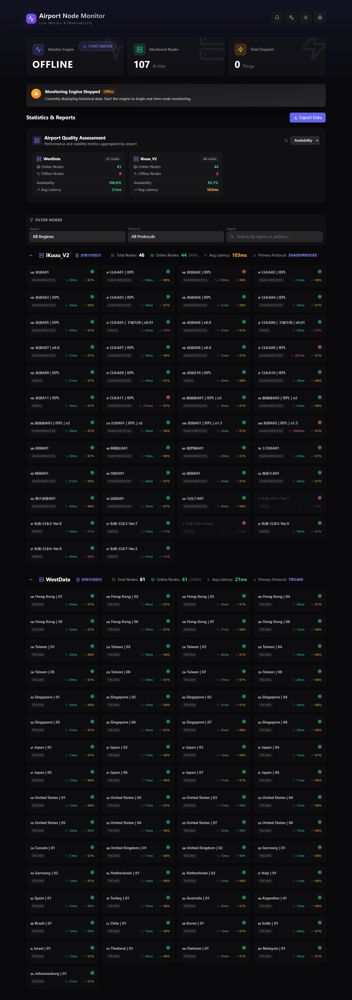
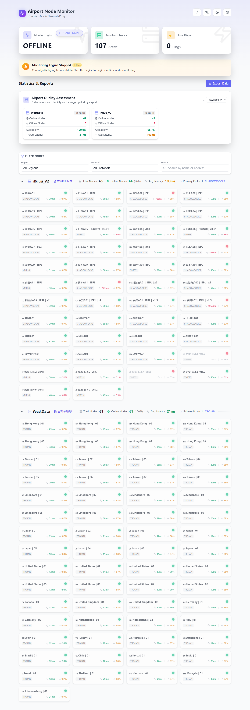
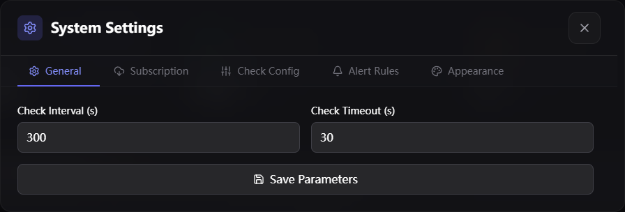
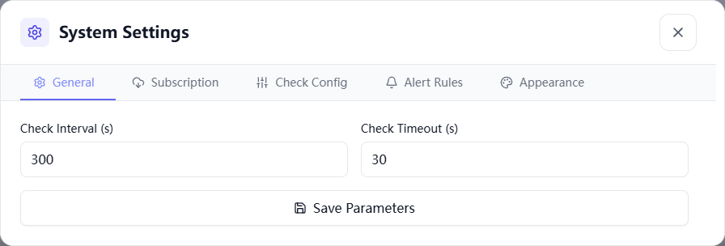
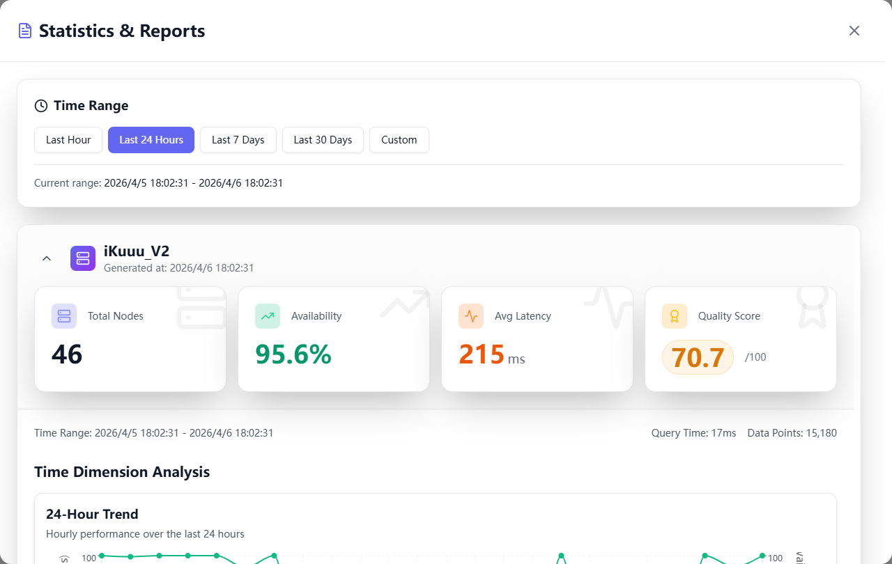

<div align="center">
  
  # 🚀 Airport Node Monitor 

  **自动化监控机场代理节点可用性、可视化统计大屏与智能规则告警系统**
  
  <p>
    
    
    
    
    
  </p>

</div>

---

## 📸 界面预览与功能展示

> 告别繁琐的命令行，通过现代化的 Web UI 实时掌控全局。系统原生适配多种使用场景。

### 🌓 极致的主题与语言适配 🌐
内置 **深色/浅色** 模式一键切换，并完整支持 **中/英文** 国际化，满足不同视觉偏好与使用习惯。

<table width="100%">
  <tr>
    <td width="50%" align="center">
      <strong>深色模式 (简体中文)</strong><br/>
      
    </td>
    <td width="50%" align="center">
      <strong>Light Mode (English)</strong><br/>
      
    </td>
  </tr>
  <tr>
    <td colspan="2" align="center">
      <em>自适应流体布局，无论在大屏还是移动端均能完美呈现节点状态。</em>
    </td>
  </tr>
</table>

### ⚙️ 模块化设置中心
支持对 **监控频率、自动订阅更新、核心检测参数及智能告警规则** 进行可视化配置。所有更改即时生效，无需重启服务。

<table width="100%">
  <tr>
    <td width="50%" align="center">
      <strong>设置面板 (深色)</strong><br/>
      
    </td>
    <td width="50%" align="center">
      <strong>Settings Panel (Light)</strong><br/>
      
    </td>
  </tr>
</table>

### 📊 深度节点诊断
点击任意节点或机场，即可调起深度分析面板。内置多维度时序图表，直观展示节点的在线分布、响应延迟瀑布流及详细日志。

<p align="center">
  
  <br/>
  <em>深度报告：支持按分钟级粒度追溯历史波动。</em>
</p>

## ✨ 核心特性

- **⚡ 高并发检测调度**：后台调度器无缝同时检测成百上千个代理节点，互不堵塞系统资源。
- **📊 全维度数据大屏**：内置按机场、协议、区域维度的精细报告，历史波动趋势长按追溯。
- **📥 支持各类订阅导入**：自动兼容 `Base64` 订阅格式、`Clash YAML`、单一通用文本格式。无惧拦截！
- **🚨 规则引擎与智能告警**：自定义您的故障阈值，并在代理出问题时快速得到告警反馈。
- **📅 灵活检测周期**：完全自定义任务轮询间隔（从 `10s` 极限测试 到 `24h` 佛系探测 随意配置）。
- **🐳 极简部署体验**：完善适配和原生集成了 Docker & Docker Compose 环境，开箱即用，无心智负担。

---

## 🎯 协议支持矩阵

全面覆盖主流核心协议的**高可用性探活**、**延迟测试**与**带宽探测**：

| 协议类型 | 检测状态 | 网络架构特征 | 
| :--- | :---: | :--- | 
| **VMess** | ✅ 完全支持 | TCP / WS / 完整加密链路、长时状态追踪 | 
| **VLESS** | ✅ 完全支持 | TCP / WS / GRPC 节点探测 | 
| **Trojan** | ✅ 完全支持 | TCP TLS 嗅探伪装探活 | 
| **Shadowsocks** | ✅ 完全支持 | 最传统的底层轻量高响应检测 | 
| **Hysteria/2** | ✅ 兼容支持 | 面向 UDP 层的高并发环境利用率检测 | 

---

## 🚀 极速部署

### 🐳 方式一：Docker 部署（推荐）

#### 选项 A：使用预构建镜像（最快）

直接使用 GitHub Container Registry 上的官方镜像，无需构建：

```bash
# 拉取最新官方镜像
docker pull ghcr.io/virgoooox/airport-monitor:latest

# 创建数据目录
mkdir -p data

# 🚀 一键启动服务
docker run -d \
  --name airport-monitor \
  -p 3000:3000 \
  -v $(pwd)/data:/app/data \
  ghcr.io/virgoooox/airport-monitor:latest

# 或使用 docker-compose（推荐）
# 1. 下载配置文件
curl -O https://raw.githubusercontent.com/VirgoooooX/Airport-monitor/main/docker-compose.yml

# 2. 修改 docker-compose.yml，将 build: . 改为:
#    image: ghcr.io/virgoooox/airport-monitor:latest

# 3. 启动服务
docker-compose up -d

# 查看日志
docker-compose logs -f
```

#### 选项 B：从源码构建

通过 `Docker Compose` 只需一秒，即可将强悍的扫描引擎与渲染中心跑满整个服：

```bash
# 克隆仓库到本地
git clone https://github.com/VirgoooooX/Airport-monitor.git
cd Airport-monitor

# ✨ 一键极速启动完整服务 (前后端)
docker-compose up -d

# 跟进容器内日志流
docker-compose logs -f
```

> **🎉 Bingo! 服务已经准备就绪！** 
> 打开浏览器访问 `http://localhost:3000` 尽情探索你的控制面板。<br/>
> 后台会自动为你在 `./data` 共享存储目录生成 `monitor.db` 本地原生数据库文件。


### 💻 方式二：本地原生开发运行

依托极度轻奢但健壮的 `TypeScript` + `Node.js` 架构，你也可以选择一行命令跑通全局环境。

```bash
# 1. 安装主引擎组件和外部库
npm install
cd frontend && npm install && cd ..

# 2. 核心打包与客户端渲染预编译
npm run build
cd frontend && npm run build && cd ..

# 3. 驱动 Web-First 主力监控守护线程
npm run start
```

*如果你是一位极客并且想要定制大屏，随时使用 `npm run dev` 激发组件的热加载之旅！*

---

## 🎛️ 详解功能全景

- **🌐 监控仪表盘 (Dashboard)**：秒级更新全区域链路通断分布饼图和响应散点，掌控全局。
- **🔧 节点与集群管理器**：直观看到“高负荷”及“高延迟”红温节点状态，多维护度排序与过滤。
- **⚙️ 订阅流管理**：多机场自动周期轮询订阅数据刷新，失效节点静默自动下线。
- **📊 专业报告中心**：通过本地 SQLite 数据强关联，自动绘制图表展示节点 24h/7days 寿命轨迹。
- **🚨 告警收容中心**：定义"香港节点组丢失率 > 30%"这类告警规则并执行拦截策略。

---

## 🧩 对外开放 API 矩阵

我们将监控面板的底层控制权全面开放为 RESTful API 接口，完全支持你接入到自动运维、脚本和上游体系中：

<details>
<summary><strong>点击展开查看 API 文档</strong></summary>

### 📡 核心与运维编排
- `GET /api/status` - 获取监控心跳引擎状态
- `GET /api/airports` - 列表索引返回所有机场下挂载的节点数 
- `POST /api/control/start` | `stop` - 拉起或阻断所有后台监控任务检测链

### 📝 订阅系统相关
- `POST /api/config/import` - 注入或追加外部上游节点的 URI
- `POST /api/subscriptions/:id/refresh` - 对指定机场执行紧急订阅全量同步
- `DELETE /api/config/airports/:id` - 执行集群驱逐

### 📈 数据汇聚下行
- `GET /api/reports/by-region` - 交叉检索各个国家/片区的总体表现分
- `GET /api/reports/by-protocol` - 协议负载画像对比分析（VMess vs Trojan等）
- `GET /api/nodes/:id/trend` - 输出单一节点时间序列探活瀑布流

### 🚨 警报钩子
- `GET /api/alerts` | `POST /api/alerts/:id/acknowledge` - 拉取触发情况/一键销账告警

</details>

---

## ⚙️ 底层配置 `config.json` 架构预览

无论如何升级环境，你的所有调度参数均全生命周期挂载至 `./data/config.json`，它足够透明：

```json
{
  "checkInterval": 300,
  "checkTimeout": 30,
  "checkConfig": {
    "tcpTimeout": 30,
    "httpTimeout": 30,
    "httpTestUrl": "https://www.google.com/generate_204",
    "latencyTimeout": 30,
    "bandwidthEnabled": false,
    "bandwidthTimeout": 60,
    "bandwidthTestSize": 1024
  },
  "logLevel": "info",
  "storagePath": "./data/monitor.db"
}
```

---

## 🛠 排障指北

遇到拦路虎？不要慌，引擎的输出足够完备可解释：

- **Docker 容器“拉胯”，不停重启？**
  - **原因 1：** `3000` 端口已经被别的 Web 服务预占了，通过 `netstat -ano | findstr 3000` 将李鬼绳之以法吧！
  - **原因 2：** 请检查宿主机映射进容器内的 `./data` 目录是否可被写入，`chmod -R 777 ./data` 能大力出奇迹。

- **节点显示 100% 测试全红（全都连不上）？**
  - 这多发于刚拉起环境，通常是你的检测机所处服务器自身到海外的上游路由阻断了出海能力，或者本地防火墙直接劫持阻断了节点对应的奇异代理端口。

如果你需要最细颗粒度追踪：
```bash
# 激活硬核 Debug 全链路输出模式
docker-compose down
docker-compose up -d -e LOG_LEVEL=debug
```

---

## 🎨 全核技术栈矩阵

| 所属领域 | 核心技术方案选型 | 具体职能定位 |
| :--- | :--- | :--- |
| **Backend** | `Node.js` + `Express` + `TypeScript` | 面向高 I/O 并发的检测调度与路由分发 |
| **Database** | `better-sqlite3` | 足够轻量的高性能无并发冲突本地持久化系统 |
| **Frontend** | `React 18` + `Vite` + `Tailwind CSS` | 原生组件化视图装配，保证 60fps 般跟手的操作交互体验 |
| **Visualizer**| `Recharts` | 强交互、动态响应式海量数据时序图表引擎 |

---

<div align="center">
  <p><strong>Released under the MIT License.</strong></p>
</div>
